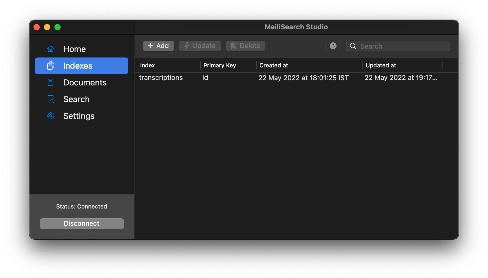

  

<h1 align="center">Meilisearch Studio</h1>
<h4 align="center">The project is on alpha version, please be patient and report any bug found.</h4>

## Getting started

Open the `MeiliSearch Studio.xcodeproj` and wait for the dependencies to be synchronized, then run the project. The project is compatible with macOS `10.15` and newer.

## 💌 Contact

Please visit [this page](https://docs.meilisearch.com/learn/what_is_meilisearch/contact.html#contact-us).

Meilisearch is developed by [Meili](https://www.meilisearch.com), a young company. To know more about us, you can [read our blog](https://blog.meilisearch.com). Any suggestion or feedback is highly appreciated. Thank you for your support!

Meilisearch Studio is developed by [ppamorim](https://github.com/ppamorim) as a example of use of [meilisearch-swift](https://github.com/meilisearch/meilisearch-swift).